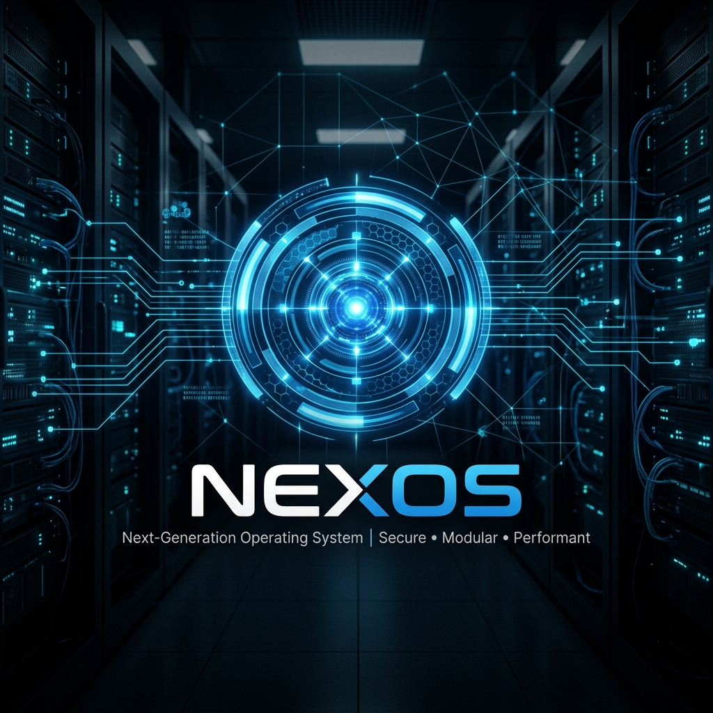
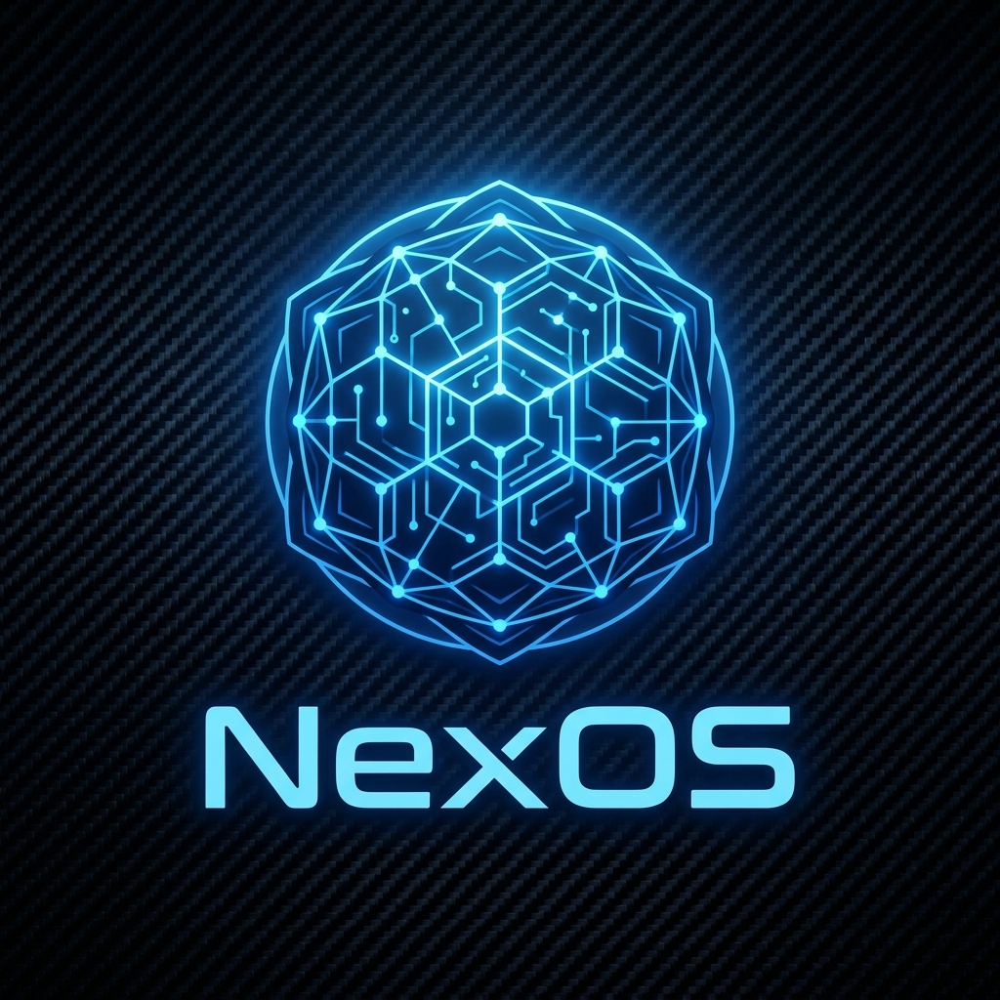

  

# 
🚀 NexOS

  <strong>La distribución Debian 13 (Trixie) definitiva para Pentesting, Servidores y Aprendizaje Experimental.</strong>
   
  <em>Soporte Dual Boot: Compatible con BIOS/Legacy y UEFI.</em>

  
  
  
  

---

## 🌟 ¿Por qué NexOS?

NexOS nace de la necesidad de tener un entorno de trabajo que sea tan potente para el **pentesting** como estable para la **administración de servidores**. Construido sobre la base sólida de **Debian Trixie**, ofrece una experiencia de usuario moderna con **KDE Plasma** y una suite de herramientas industriales pre-configuradas.

---

## ✨ Características Destacadas

| 🛡️ Seguridad | 🌐 Servidores | 💻 Escritorio | 🤖 Automatización |
| :--- | :--- | :--- | :--- |
| **Metasploit**, **Nmap**, **Wireshark** y más. | **Nginx**, **MariaDB** y **SSH** listos para usar. | **KDE Plasma** ultra-personalizado y fluido. | Compilación 100% automática en **GitHub Actions**. |

---

## 📂 Documentación y Guías
Para una experiencia completa, consulta nuestra documentación oficial en la Wiki:
👉 **[Wiki de NexOS](https://github.com/jpscalero/NexOS/wiki)**

---

## 🛠️ Inicio Rápido

### 1. Obtener la ISO
- **GitHub Release (Recomendado)**: Descarga la última versión estable desde la sección de **[Releases](https://github.com/jpscalero/NexOS/releases)**.
- **Compilación Manual**: Crea tu propia versión permanente simplemente creando un `Tag` en Git.

### 2. Credenciales por Defecto
| Usuario | Contraseña | Hostname |
| :--- | :--- | :--- |
| `nexos` | `nexos` | `nexos` |

---

## 🚀 Hoja de Ruta (Roadmap)
Estamos trabajando constantemente para mejorar. Algunos de nuestros próximos hitos incluyen:
- [ ] Soporte para arquitectura ARM (Raspberry Pi).
- [ ] Integración de un instalador gráfico avanzado.
- [ ] Suite de análisis de malware aislada.
Ver más en **[ROADMAP.md](ROADMAP.md)**.

---

## 🤝 Comunidad y Gobernanza
NexOS es un proyecto abierto y profesional. Valoramos la colaboración y la seguridad:
- 🐞 **¿Encontraste un error?** Abre un [Bug Report](https://github.com/jpscalero/NexOS/issues/new?template=bug_report.md).
- 💡 **¿Tienes una idea?** Envía una [Feature Request](https://github.com/jpscalero/NexOS/issues/new?template=feature_request.md).
- 🛡️ **Seguridad**: Lee nuestra [Política de Seguridad](SECURITY.md).
- 📜 **Conducta**: Revisa nuestro [Código de Conducta](CODE_OF_CONDUCT.md).

---

  Hecho con ❤️ por la comunidad de NexOS.
   
  

